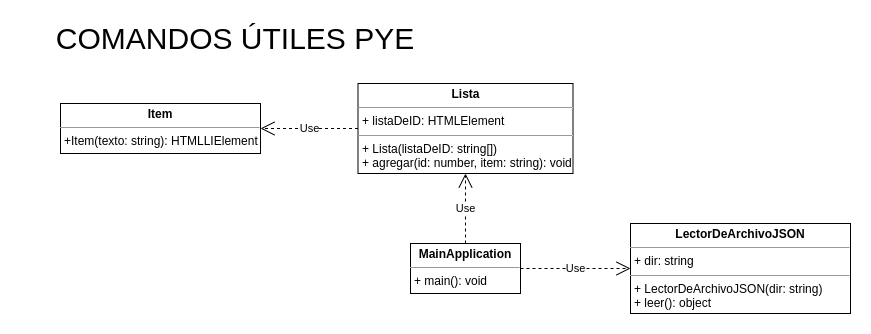

# COMANDOS ÚTILES PYE

## Árbol de Carpetas/Archivos

```bash
assets
 ┣ icon
 ┃ ┗ favicon.webp
 ┣ images
 ┃ ┗ header.png
 ┣ js
 ┃ ┣ item.js
 ┃ ┣ lector-de-archivo-json.js  // encargado de leer el archivo json y retornar la lista
 ┃ ┣ lista.js                   // contiene el método para agregar a la lista de nuestra página
 ┃ ┗ main.js                    // archivo principal donde contiene la clase MainApplication
 ┣ json
 ┃ ┗ comandos.json              // en este archivo se van agregando los comandos más utilizados
 ┗ style
 ┃ ┣ reset.css                  // https://meyerweb.com/eric/tools/css/reset/
 ┃ ┗ style.css                  // contiene las clases para el body, header y main.
```

## Diagrama de Clases



Por el momento no se da más detalle sobre la relación entre las clases. Por el momento solo se lo relaciona como cliente/proveedor.
